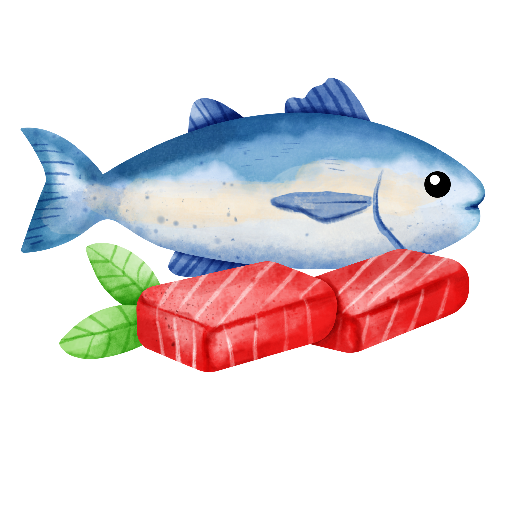
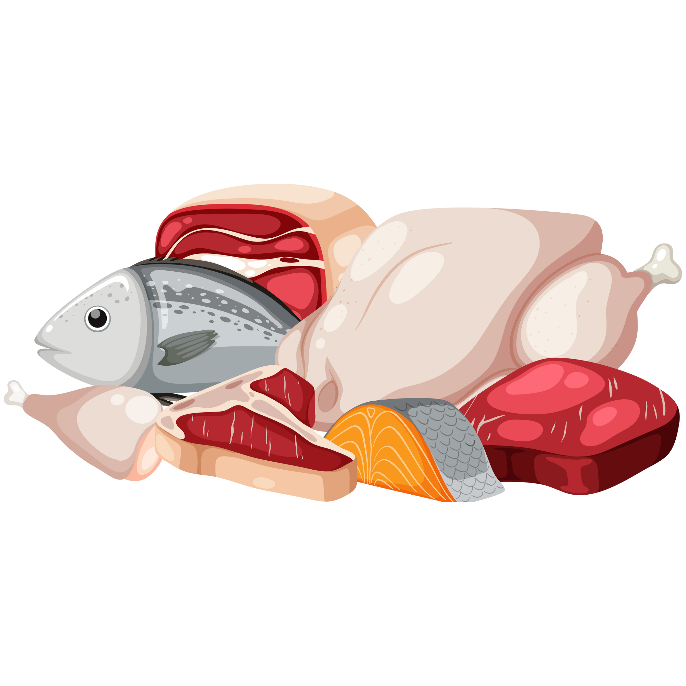
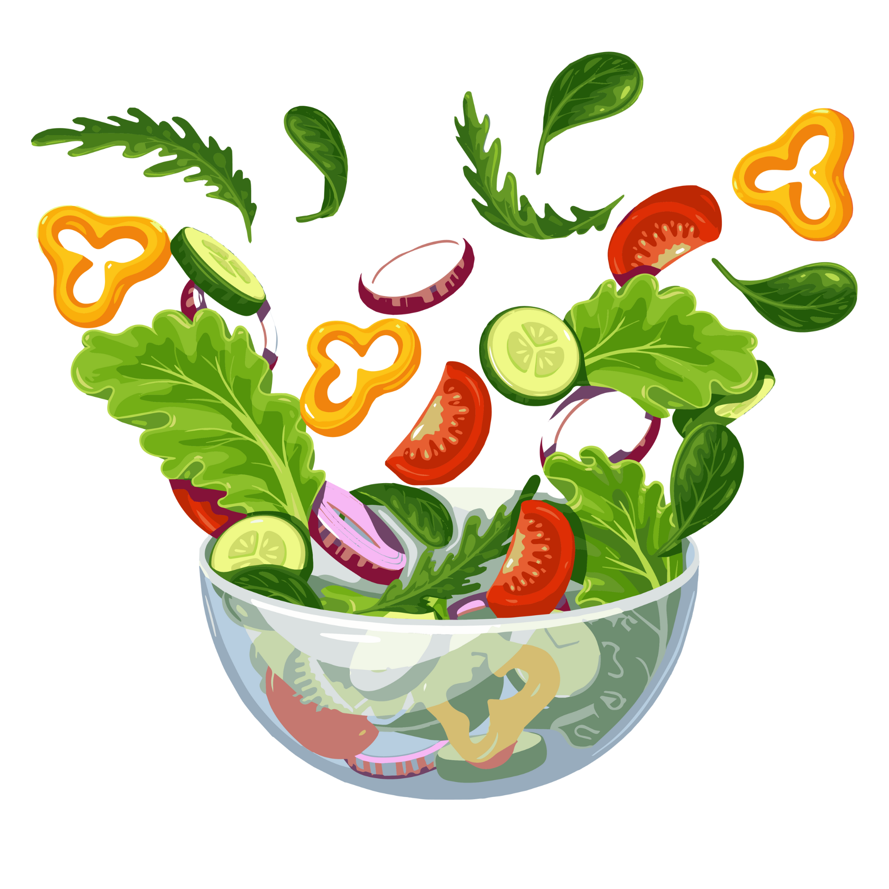
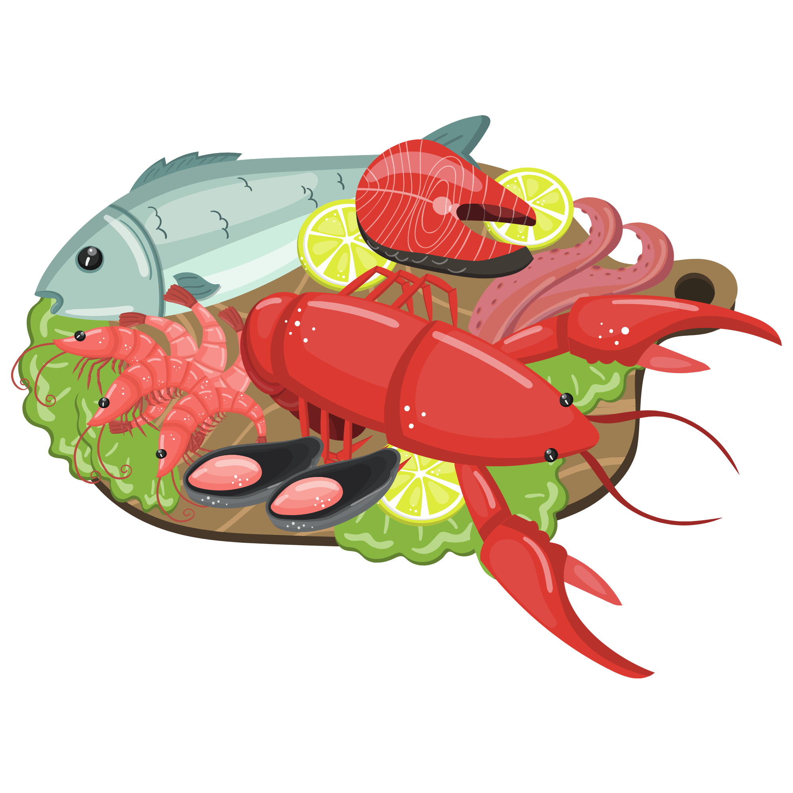
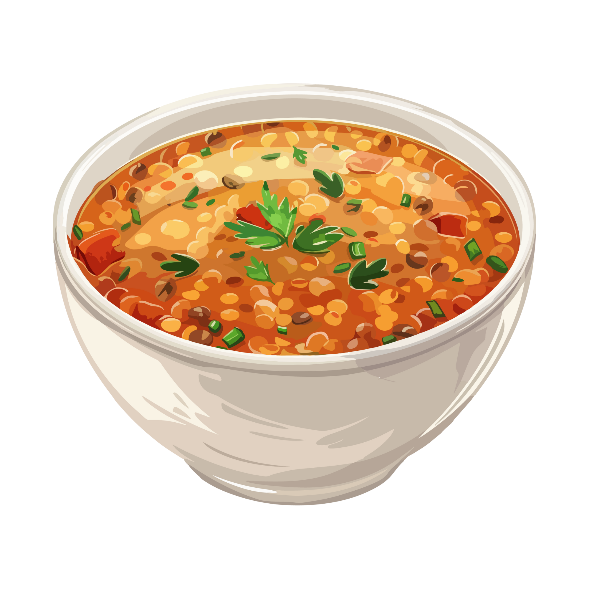
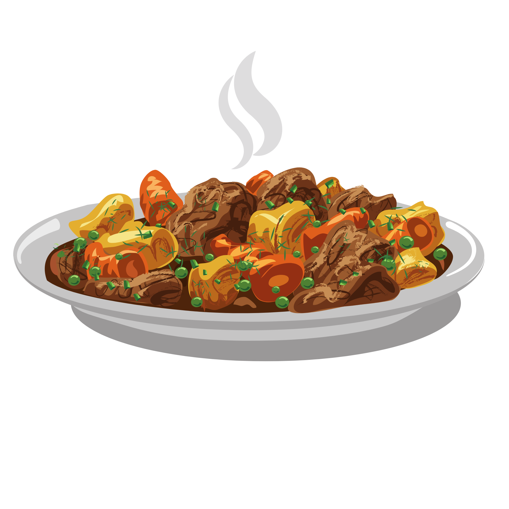
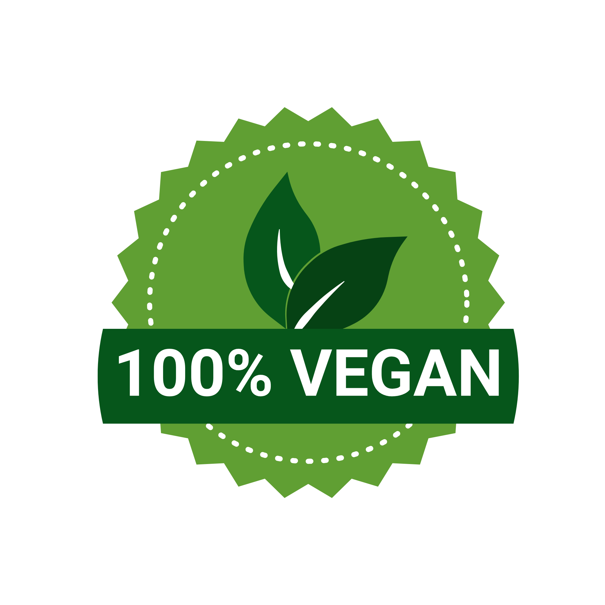
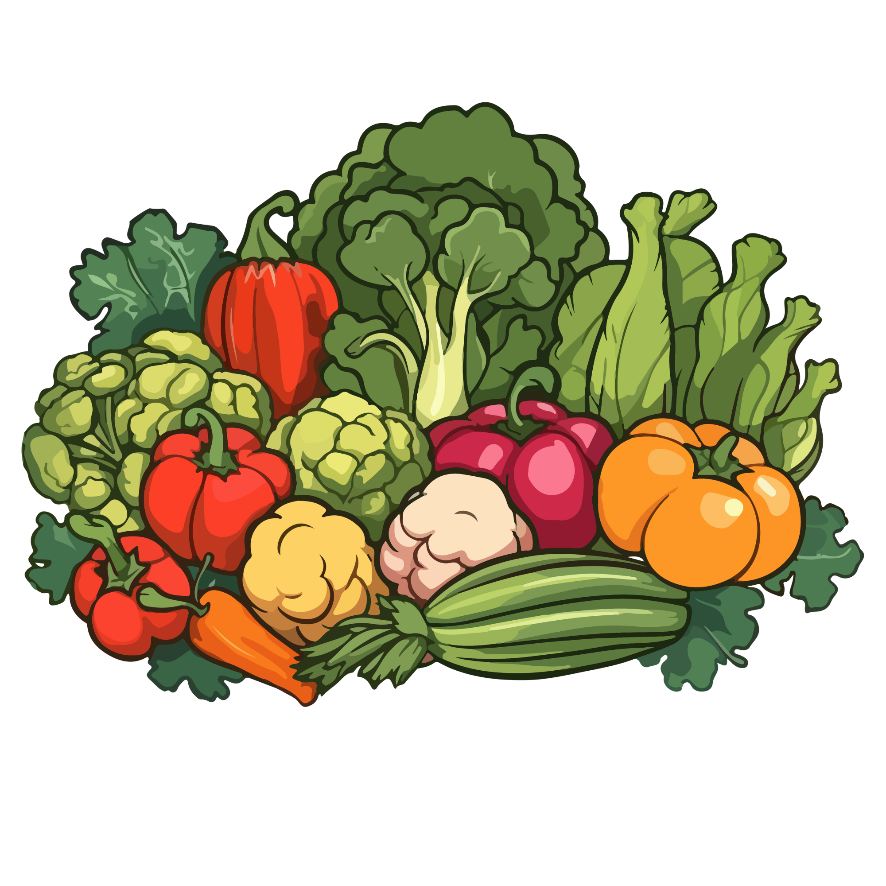

# Assignment 4

A WPF (Windows Presentation Foundation) application for managing recipes.

## Features

*   **Recipe Management**: Add, edit, and view recipes.
*   **Food Categories**: Categorize recipes (e.g., Meat, Vegan, Dessert).
*   **Ingredient Management**: Handle ingredients for each recipe.

## Assets

This project includes various icons representing food categories:

| Category | Icon | Category | Icon |
|----------|------|----------|------|
| Beverages |  | Desserts |  |
| Fish |  | Meat |  |
| Pasta |  | Pizza |  |
| Salads |  | Seafood |  |
| Snacks |  | Soups |  |
| Stew |  | Vegan |  |
| Vegetarian |  | Other |  |

## How to Run

1.  Open `Assignment4.csproj` in Visual Studio.
2.  Build and Run (`F5`).
