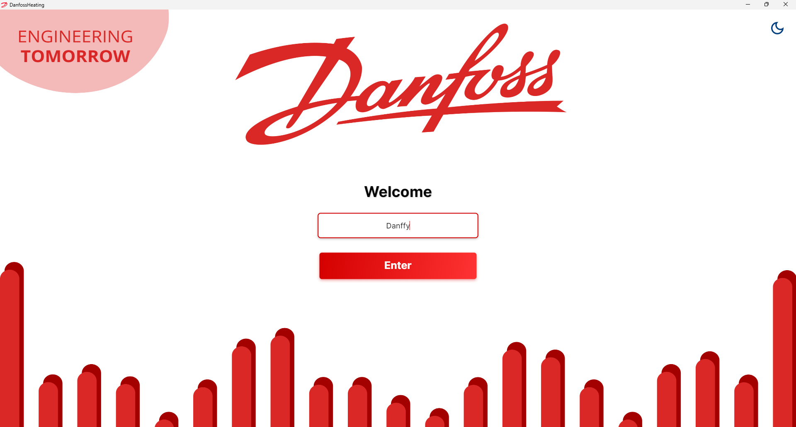
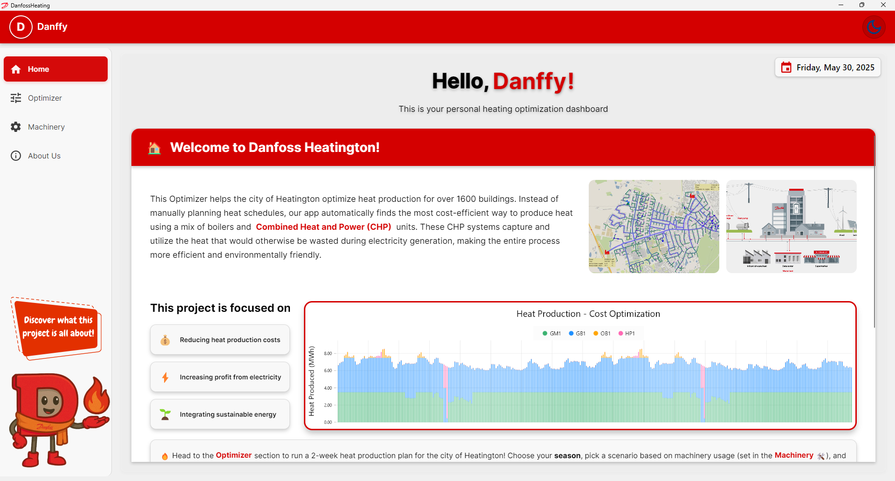
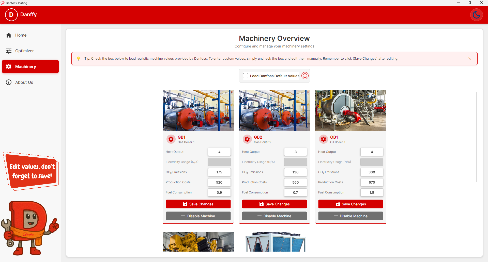
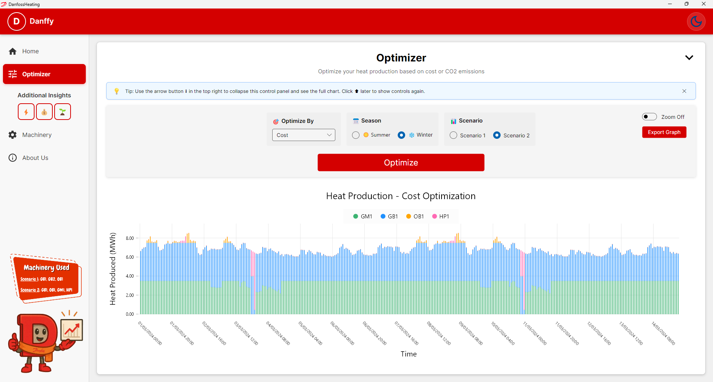
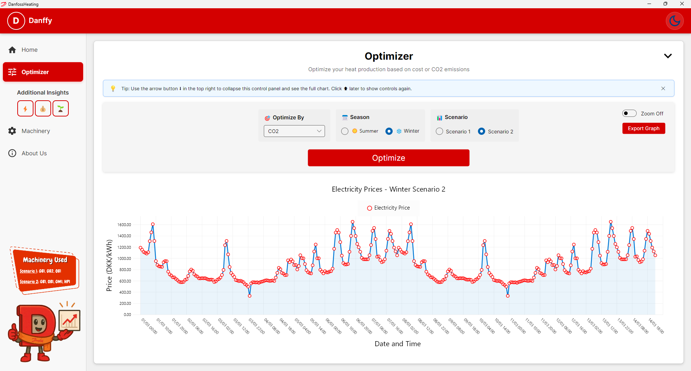
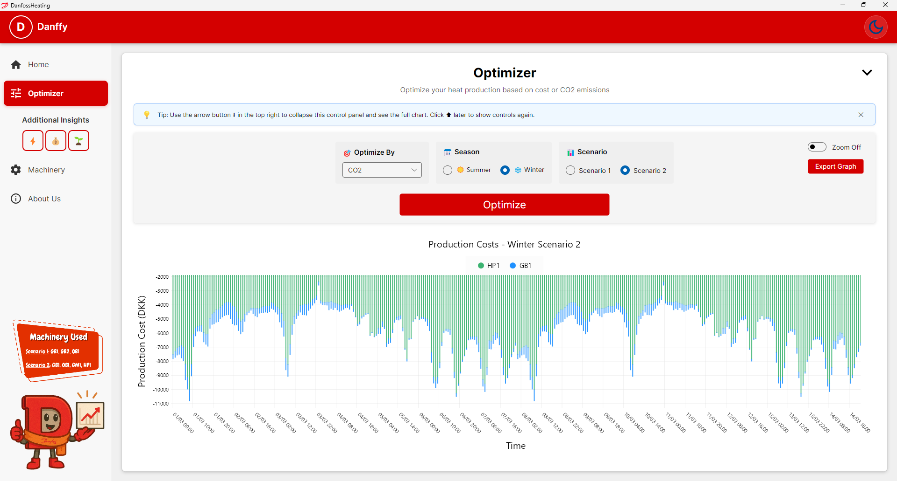
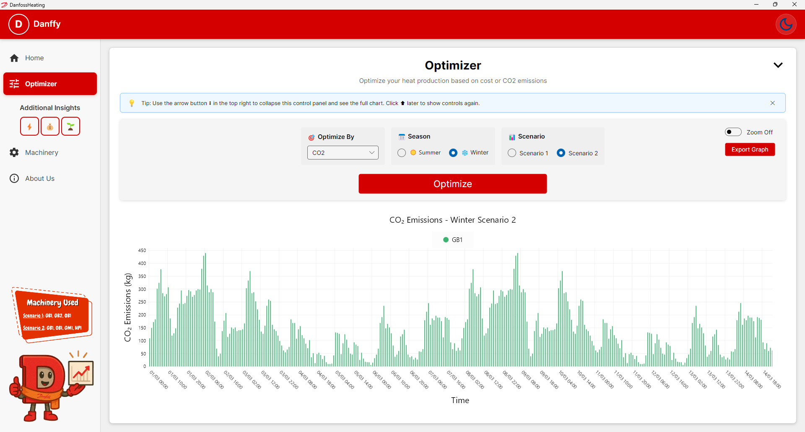

# Danfoss Heating App - Assignment 7 Malmo University

**⚠️ Note for the User:**
This application uses CSV and JSON files in the `/Data` folder. You can test the optimization with sample data for heat demand and electricity prices.

## 🚀 Getting Started

Run the application in two modes:

- **GUI mode:** From the project root, run:

  ```bash
  dotnet run
  ```

  This starts the Avalonia-based graphical interface.

- **Console mode:** From the project root, run:

  ```bash
  dotnet run -- --term
  ```

  This starts the original console-only version.

The application is written in **C#**.

## 📌 Project Overview

I developed this app to automate district heating schedules for the city of Heatington. It finds the cheapest way to meet heat demand while maximizing electricity market profits. I built it with Avalonia for a modern UI and used a modular design for clear data flow.

## 🎯 Features

- **Cost Optimization**: Calculates the cheapest mix of heat units hour by hour.
- **Dark Mode**: Toggle between light and dark themes.
- **Downtime Management**: Enable or disable individual machines for maintenance.
- **Customizable Unit Settings**: Edit production values, costs, and limits for each machine.
- **Modules**:
  - **Asset Manager (AM)**: Static data for machines and grid layout.
  - **Source Data Manager (SDM)**: Time series for heat demand and electricity prices.
  - **Result Data Manager (RDM)**: Saves optimization results to CSV.
  - **Optimizer (OPT)**: Core logic for schedule generation.
  - **Data Visualization (DV)**: Graphs for demand, production, costs, and emissions.
- **Unit Testing**: Verifies that methods and modules work correctly. I wrote:
  - 4 tests for Asset Manager (AM)
  - 3 for Source Data Manager (SDM)
  - 3 for Optimizer (OPT)
  - 2 for Result Data Manager (RDM)
  - 2 for User Interface (UI)
  - 4 functional tests

## 📁 Project Structure

```plaintext
DanfossHeating/
├── Assets/
│   ├── Danffy/          # UI screenshots
│   ├── Group3/          # Team photos
│   ├── Machines/        # Unit images
│   └── README/          # Images referenced by README
├── Converters/          # Data converters for UI
├── Data/                # CSV and JSON data files
├── Models/              
│   ├── AssetManager/    
│   ├── Optimizer/       
│   ├── ResultDataManager/
│   └── SourceDataManager/
├── ViewModels/          # UI logic
├── Views/               # UI layouts
├── Program.cs           # Entry point
└── README.md            # This file

DanfossHeatingTests/
├── AssetManagerTests.cs
├── OptimizerTests.cs
├── ResultDataManagerTests.cs
├── SourceDataManagerTests.cs
└── UITests.cs
```

---

## 🔧 How to Run

1. **App:** Open a terminal in the `DanfossHeating` folder and run:

   ```bash
   dotnet run
   ```

2. **Tests:** Open a terminal in `DanfossHeatingTests` and run:

   ```bash
   dotnet test
   ```

---

## 📊 Scenarios

- **Scenario 1:** Two gas boilers and one oil boiler.
- **Scenario 2:** Gas boiler, oil boiler, gas motor (produces electricity), and heat pump (consumes electricity).

---

## 🖼️ Screenshots & Assets

Below is a quick visual tour of the app's main features:

- **Welcome Page**  
  

- **Home Page**  
  

- **Dark Mode Overview**  
  

- **Machinery Configuration**  
  

- **Optimizer Schedule Flow**  
  

- **Electricity Prices**  
  

- **Production Cost Overview**  
  

- **CO₂ Emissions Chart**  
  
