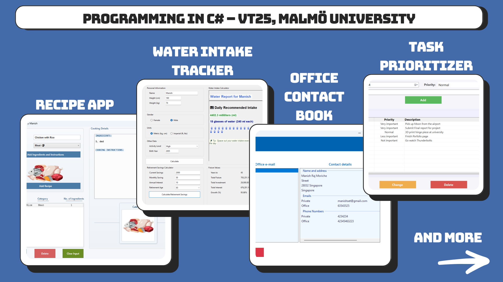

# MALMO_VT25 - Homework Exercises

This repository contains **six homework assignments** for the **MALMO_VT25 course**, completed by **Manish Raj Moriche and [Luigi Colluto](https://github.com/Lucol24)**.

## 📁 Projects Overview

| Project | Preview | Type | Framework | Description |
| :--- | :--- | :--- | :--- | :--- |
| **Assignment 1** |  | Console Application | .NET 8.0 | Basic classes and logic implementation (Album, Pet, TicketSeller). |
| **Assignment 2** |  | Console Application | .NET 8.0 | Collection of small utility programs (Cost Calculator, Guess The Number, String Functions, Scheduler). |
| **Assignment 3** |  | Windows Forms (WinForms) | .NET 9.0 | Calculators for retirement savings, BMI, and water intake. |
| **Assignment 4** |  | WPF Application | .NET 9.0 | A Recipe Manager application to manage food recipes. |
| **Assignment 5** |  | Windows Forms (WinForms) | .NET 9.0 | A Contact Management system. |
| **Assignment 6** |  | Windows Forms (WinForms) | .NET 10.0 | A Task Manager application with file handling capabilities. |

## 📁 Repository Structure
Each assignment is organized into its own folder. Inside each folder, you will find:
- 📂 **Project files** for the assignment.
- 📄 **README file**, which includes:
  - A brief description of the program.
  - A breakdown of which parts were completed by each contributor.

## 👥 Contributors
- **Manish Raj Moriche**
- **[Luigi Colluto](https://github.com/Lucol24)**

---

Feel free to explore the assignments and check out the README files inside each folder for more details! 🚀
